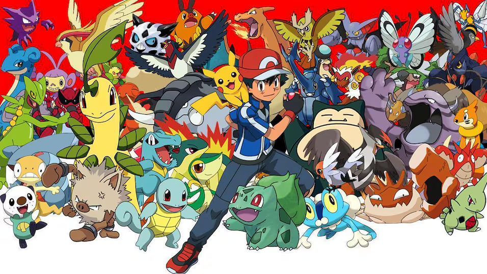

# Pokémon Explorer



Pokémon Explorer is a Flask-based web application that allows users to search for Pokémon and view information fetched from the Pokémon REST API.

This project was built to practice and demonstrate **Python, Flask, REST API consumption, HTTP requests, query parameters, input validation, error handling, JSON data handling, HTML templates, and production deployment**.

## Features

* Search for Pokémon by name, type, ability, or move
* Fetch Pokémon information from an external REST API
* Display processed API data through a web interface
* Use form-based search and query handling
* Input validation
* Error handling for invalid Pokémon and API requests
* Dynamic HTML pages using Flask templates
* Template inheritance
* Static files including images and CSS
* Clean and modular Flask project structure
* Production deployment using Gunicorn and Render

## Live Demo

🌐 **Deployed Application:**
https://pokemon-explorer-ysso.onrender.com

> The application is deployed on Render using Gunicorn as the production WSGI server.

## Tech Stack

* **Python**
* **Flask**
* **Requests**
* **HTML/CSS**
* **Gunicorn**
* **Render**
* **Git & GitHub**

## Project Structure

```text
Pokemon_Explorer/
│
├── application/
│   ├── static/
│   │   └── images/
│   ├── templates/
│   │   ├── base.html
│   │   ├── forms.html
│   │   └── home_page.html
│   ├── __init__.py
│   ├── helper_func.py
│   └── routes.py
│
├── main.py
├── requirements.txt
├── README.md
└── .gitignore
```

## How It Works

1. The user selects a search option and enters Pokémon-related information through the web interface.
2. Flask receives the submitted form data.
3. The application sends an HTTP request to the Pokémon REST API using the `requests` library.
4. The API returns Pokémon data in JSON format.
5. The Flask application processes the required information from the JSON response.
6. The processed data is passed to the appropriate HTML template.
7. Jinja templates dynamically display the Pokémon information.
8. Invalid input and API errors are handled appropriately.

## Run Locally

1. Clone the repository

   ```
   git clone <repository-url>
   cd Pokemon_Explorer
   ```

2. Create a virtual environment

   ```
   python -m venv .venv
   ```

3. Activate the virtual environment

   For Windows:

   ```
   .venv\Scripts\activate
   ```

   For macOS/Linux:

   ```
   source .venv/bin/activate
   ```

4. Install dependencies

   ```
   pip install -r requirements.txt
   ```

5. Run the application

   ```
   python -m main
   ```

   The application will start on the local Flask development server.

## Deployment

The application is deployed as a production web service using Gunicorn and Render.

### Deployment Process

1. The project was structured as a Flask application with the Flask app created inside the `application` package.
2. A `requirements.txt` file was created containing the required Python dependencies.
3. Gunicorn was added as the production WSGI server.
4. The project was uploaded to a GitHub repository.
5. A Render Web Service was created and connected to the GitHub repository.
6. The `main` branch was selected for deployment.
7. The build command was configured as:

   ```
   pip install -r requirements.txt
   ```

8. The production start command was configured as:

   ```
   gunicorn application:app
   ```

9. Render automatically builds and deploys the application whenever changes are pushed to the connected GitHub repository.

### Gunicorn Command

```
gunicorn application:app
```

Here:

* `application` refers to the Flask package containing `__init__.py`.
* `app` refers to the Flask application object created inside `application/__init__.py`.

## Learning Objectives

This project helped me practice:

* Flask application structure
* REST API consumption
* HTTP requests and responses
* Form handling and query parameters
* JSON data handling
* Nested JSON data processing
* Input validation
* Error handling
* Jinja template rendering
* Template inheritance
* Static files
* Virtual environments
* Production WSGI servers
* Git and GitHub
* Production web application deployment

## Future Improvements

* Add more Pokémon information
* Add additional search and filtering options
* Improve API error responses
* Add caching
* Add automated tests
* Improve the user interface
* Add more API endpoints
